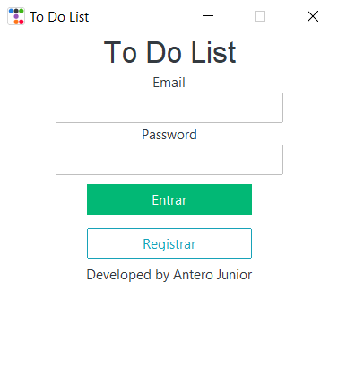
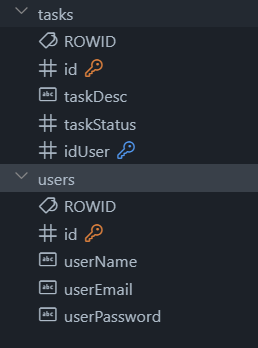

# To Do List - TKinter 📋

Projeto feito para obtenção de nota final na disciplina Laboratório de Programação II.

Para este projeto foi necessário utilizar como ferramentas principais:
1. Python
2. SQLite

Para o desafio proposto, me foi solicitado um sistema que funcionasse fora do terminal, uma aplicação desktop, com o uso do TKinter como ferramenta principal para isso.

## Tecnologias

1. Python
2. SQLite
3. TKinter 
4. ttkbootstrap (estilização)
5. Pygame (música)
6. Passlib (pbkdf2_sha256)

## Modo de uso

1. Faça o clone do repositório na sua máquina
`git clone https://github.com/AnteroJunior/todo-list-tkinter.git`

2. Ative o ambiente virtual (venv) do Python

    2.1. Caso não tenha iniciado, execute o comando `python -m venv venv`

    2.2. Ative o venv - Windows (Prompt): `venv\Scripts\activate.bat`

3. Utilizando o `pip`, instale os pacotes necessários para a execução do projeto `pip install -r requirements.txt`

4. Após tudo instalado e configurado, execute o arquivo `main.py` (`python main.py`)

## Tabelas

O sistema conta com duas tabelas: 'users' e 'tasks'. A tabela de tarefas está ligada ao usuário por meio de chave estrangeira (FK), userId.

## Autor
Antero Arcanjo

